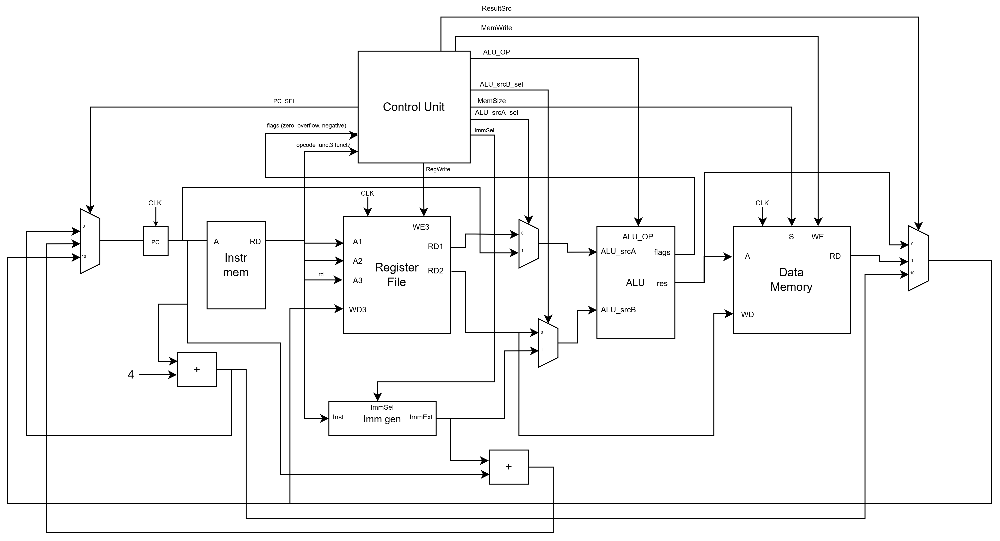

# CPU Arch Info

Single-cycle RISC-V CPU implementation.

## ALU Operations

| ALU Op | Operation | funct3 | funct7[5]|  
|--------|-----------|--------|----------|
| 0000   | ADD       | 000    | 0(0)00000|
| 0001   | SUB       | 000    | 0(1)00000|
| 0010   | XOR       | 100    | 0(0)00000|
| 0011   | OR        | 110    | 0(0)00000|
| 0100   | AND       | 111    | 0(0)00000|
| 0101   | SLL       | 001    | 0(0)00000|
| 0110   | SRL       | 101    | 0(0)00000|
| 0111   | SRA       | 101    | 0(1)00000|
| 1000   | SLT       | 010    | 0(0)00000|
| 1001   | SLTU      | 011    | 0(0)00000|

## I Type Instrs

|funct3  | Instruction | ALU Op |  
|--------|-------------|--------|
| 000    | ADDI        | 0000   |
| 010    | SLTI        | 1000   |
| 011    | SLTIU       | 1001   |
| 100    | XORI        | 0010   |
| 110    | ORI         | 0011   |
| 111    | ANDI        | 0100   |
| 001    | SLLI        | 0101   |
| 101    | SRLI        | 0110   |
| 101    | SRAI        | 0111   |

## TODO

- [x] CPU architecture diagram
- [ ] Datapath description
- [ ] Control signals table
